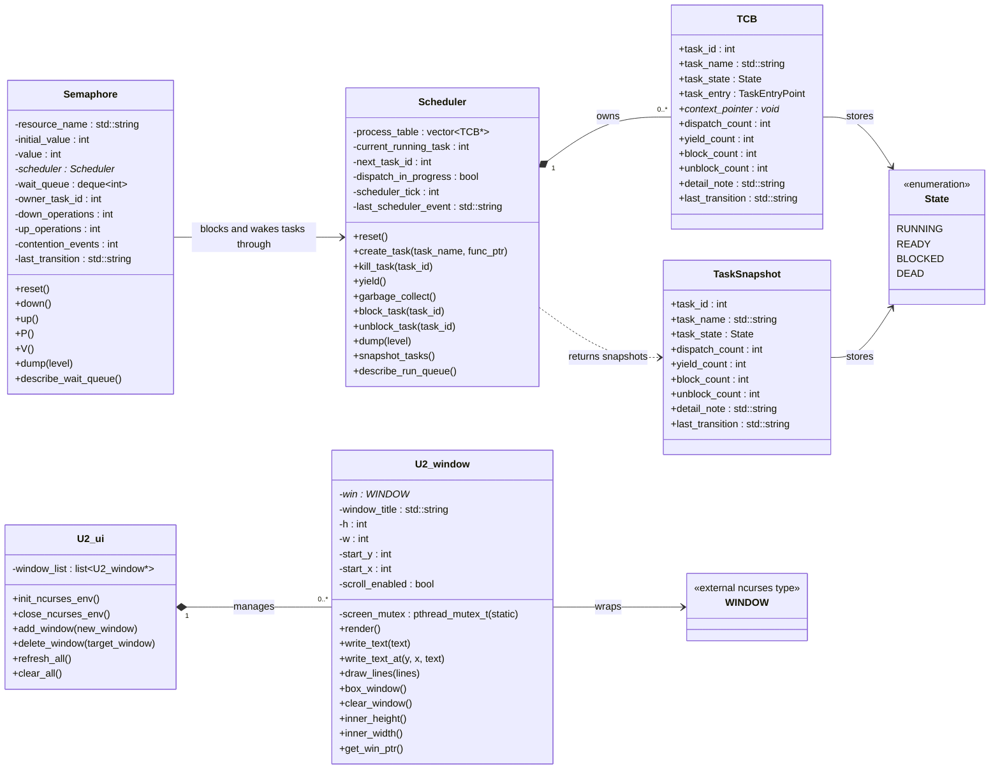

# ULTIMA 2.0 Combined Design Diagram

This diagram is derived from the current Phase 1 C++ interfaces in the repository. It captures every concrete class in the codebase plus the task data structures that those classes exchange.

## Notes

- `Scheduler`, `Semaphore`, `U2_ui`, and `U2_window` are the four concrete classes currently implemented in the repo.
- `TCB`, `TaskSnapshot`, and `State` are included because they define the scheduler's observable state model and appear in the public interface.
- `WINDOW` is shown as an external dependency from `platform_curses.h`, not as project-owned logic.
