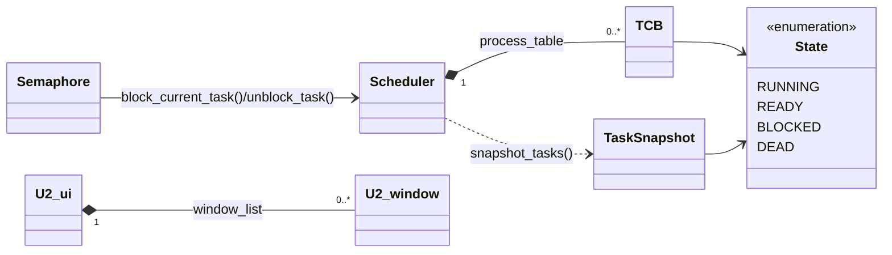
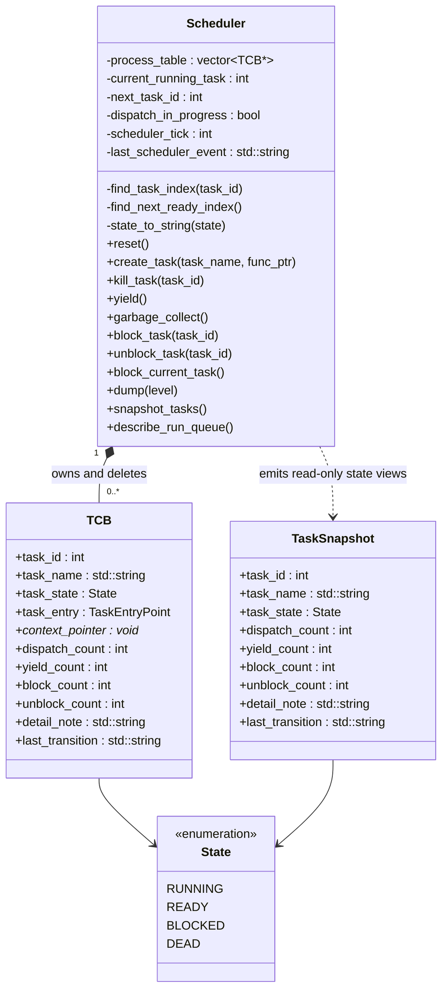
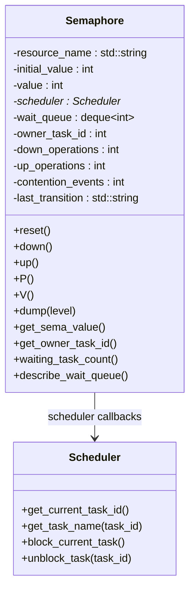
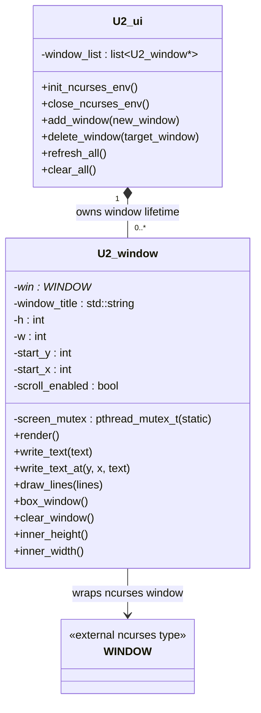

# Phase 1 Diagram

This file turns the former placeholder into source-controlled class diagrams for the Scheduler and Semaphore phase. The diagrams reflect the headers currently shipped in this repository.

## Phase 1 Class Overview

## Scheduler Detail

## Semaphore Detail

## UI Detail

## Coverage of Concrete Classes

- `Scheduler`
- `Semaphore`
- `U2_ui`
- `U2_window`

Supporting scheduler state types shown in the diagrams:

- `TCB`
- `TaskSnapshot`
- `State`
